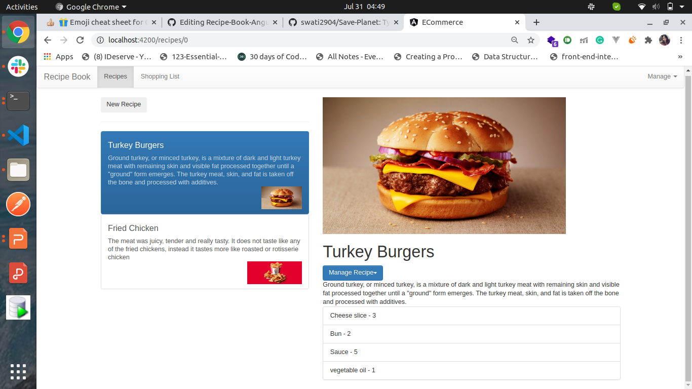
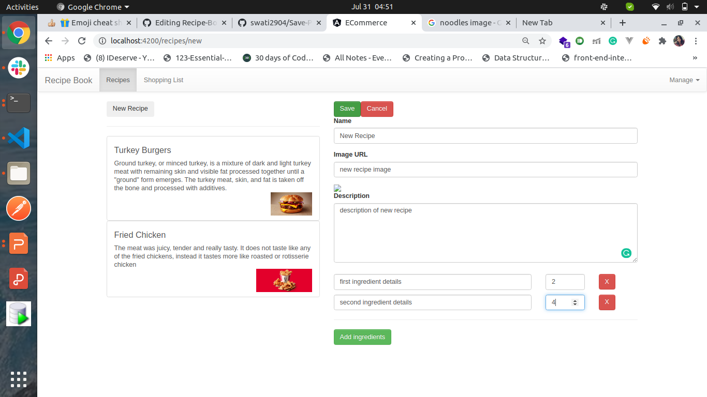
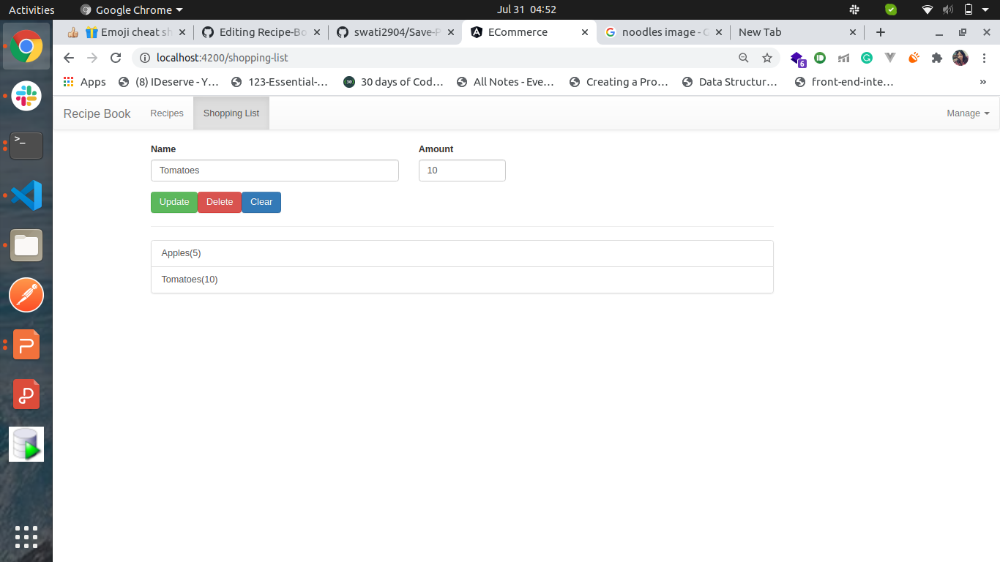
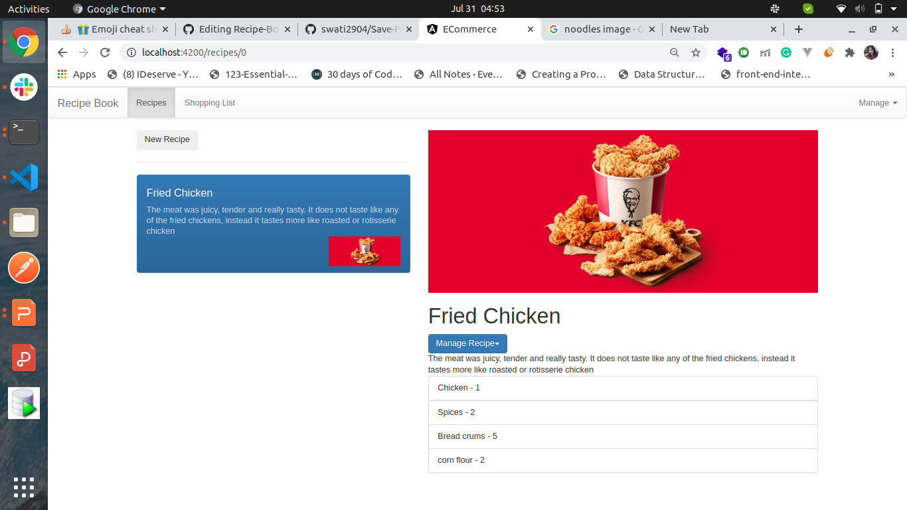

#  :stew: Recipe-Book Web Application

* Project completed within a week.
* User can create or add their own recipes in the recipe book. which helps to other who are new in the cooking or those who wants to follow their passion.

# Read Some Important points

* This project was generated with [Angular CLI](https://github.com/angular/angular-cli) version 10.0.0.

  #### Development server

  * Run `ng serve` for a dev server. Navigate to `http://localhost:4200/`. The app will automatically reload if you change any of the source files.

  #### Code scaffolding

   * Run `ng generate component component-name` to generate a new component. You can also use `ng generate directive|pipe|service|class|guard|interface|enum|module`.

  #### Build

  * Run `ng build` to build the project. The build artifacts will be stored in the `dist/` directory. Use the `--prod` flag for a production build.

  #### Running unit tests

  * Run `ng test` to execute the unit tests via [Karma](https://karma-runner.github.io).

  #### Running end-to-end tests

  * Run `ng e2e` to execute the end-to-end tests via [Protractor](http://www.protractortest.org/).

# Functionalities
  
* Users will able to add thier own recipes inside the recipe book.
* Whenever user wants, they can add/remove/update the recipe book.
* Manage the list of ingredients.
* increase and decrease the quantity of the recipe.
* upload the image of the recie and add the description.
* Get the details of previously added recipe and able to perform the CRUD operations

# Screenshot

  
  

